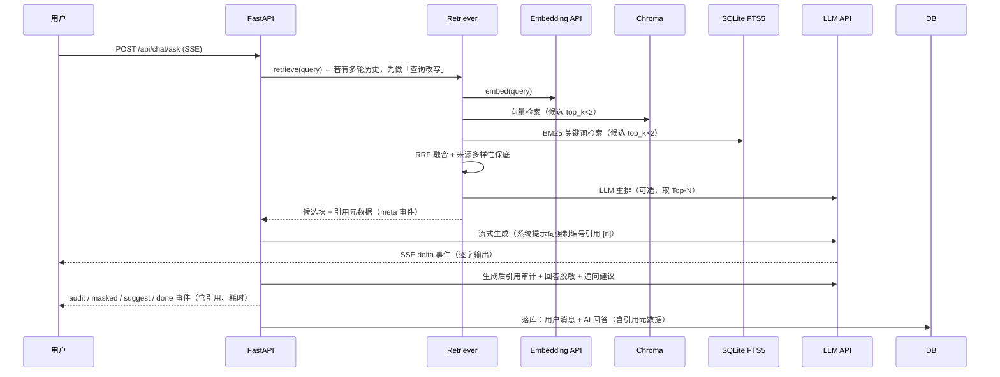

# KnowHub（知枢）项目详解 · 快速入门指南

> 本文档面向**第一次接触本项目的人**，用最少的篇幅讲清楚：这是什么项目、用什么技术、怎么跑起来、代码怎么组织、核心逻辑是什么。读完本文档即可上手开发或演示。

---

## 1. 项目是什么（30 秒版）

**KnowHub（知枢）是一个企业级 RAG 知识库问答平台**：

- 员工/用户把**文档**（PDF、Word、Excel、PPT、Markdown、TXT 等）上传到**知识库**；
- 系统自动完成 **解析 → 切分 → 向量化 → 建立混合索引**（异步后台任务）；
- 用户提问时，系统做 **向量 + 关键词混合检索 → LLM 重排 → 带引用标注的流式回答**；
- 内置**多租户隔离、RBAC 三级权限、操作审计、问答反馈、检索调试台、数据仪表盘**等企业级能力。

一句话：**上传文档 → AI 自动学习 → 员工用自然语言问答，答案带出处（哪篇文档、第几页）**。

---

## 2. 核心功能总览

| 功能 | 说明 |
|---|---|
| 📚 多格式文档接入 | Markdown / TXT / HTML / **PDF（保留页码）** / Word（含表格）/ Excel（逐工作表）/ PPT（含表格） |
| 🧠 智能切分 | Markdown 标题感知切块 + 段落感知 + 定长重叠，**每个知识库可独立调参** |
| 🔍 混合检索 | 语义向量（ChromaDB）+ 关键词 BM25（jieba 分词 + SQLite FTS5）+ **RRF 融合** |
| 🎯 LLM 重排 | 大模型对候选片段按相关性二次排序（可开关），含"主体一致性"与"多文档覆盖"约束 |
| 💬 流式问答 | SSE 实时输出，回答逐句带引用 `[1][2]`，点击引用可查看原文片段与页码 |
| 🔄 模型降级 | 对话模型与向量模型**双链路**主备自动切换（qwen-max → glm-5 → …） |
| 👥 多租户 + RBAC | 租户数据隔离（全局库所有租户共享）；admin / editor / viewer 三级角色 |
| 📝 用户注册 | 登录页自助注册（默认只读），管理员可在系统管理中调整角色/租户/启停 |
| 📋 操作审计 | 登录、注册、上传、删除、问答全部留痕，管理端可查可筛 |
| ⚙️ 异步索引 | 上传即返回，后台解析→切分→向量化，前端实时进度，**重启自动恢复**中断任务 |
| 🔐 安全 | PBKDF2-SHA256（60 万轮）密码、JWT 过期、登录/注册/问答限流、上传类型与大小校验、回答脱敏 |
| 📊 管理能力 | 数据仪表盘（问答趋势/知识库规模/热门问题）、检索调试台、内容检索、API 集成、系统日志 |
| 🔌 对外集成 | **OpenAI 兼容接口**（`/v1/chat/completions`），外部系统可用标准 OpenAI SDK 直接调用 RAG 问答 |
| 🗑 文档管理 | 回收站（软删除可恢复）、批量删除/重建、版本替换、ZIP 批量导入、知识库导出/导入/克隆 |

---

## 3. 技术栈

### 后端（`backend/`）
| 技术 | 用途 |
|---|---|
| Python 3.11 + FastAPI 0.115 | Web API 框架 |
| SQLAlchemy 2.0 | ORM（SQLite 默认，可切 PostgreSQL） |
| ChromaDB | 向量数据库（本地持久化，每知识库独立 collection） |
| SQLite FTS5 + jieba | 中文关键词索引 + BM25 检索 |
| openai SDK | 对接任意 **OpenAI 兼容网关**（阿里云百炼 DashScope / vLLM / one-api / 私有化） |
| pypdf / python-docx / openpyxl / python-pptx | 文档解析 |
| pyjwt + hashlib | JWT 认证 + PBKDF2 密码哈希 |
| pytest + TestClient | 离线可跑的单元/集成测试（embedding 已 mock） |

### 前端（`frontend/`）
| 技术 | 用途 |
|---|---|
| Vue 3.4 + TypeScript + Vite | 框架与构建 |
| Ant Design Vue 4 | 企业级组件库（表格/表单/抽屉/统计卡片） |
| Pinia | 状态管理（登录态） |
| Vue Router | 路由（登录守卫） |
| ECharts | 仪表盘图表（问答趋势/文档趋势等） |
| marked + dayjs | Markdown 渲染（流式回答）+ 时间格式化 |

### 部署
- **Docker Compose**：`api`（FastAPI）+ `web`（nginx 托管前端 + SSE 反代），数据持久化在 volume `knowhub-data`
- **本地运行**：uvicorn + vite dev（已配置 `/api` 代理）；`npm run build` 后后端可直接托管前端产物

---

## 4. 系统架构

```mermaid
flowchart LR
    subgraph Client
        UI[Vue 3 + Ant Design Vue 控制台<br/>问答 / 知识库 / 系统管理]
    end

    subgraph Backend[FastAPI 后端]
        API[API 层<br/>auth / kbs / documents / chat / admin / openai-compat]
        SVC[服务层<br/>ingestion / chat / audit]
        RAG[RAG 核心<br/>parsers → chunkers → embeddings<br/>retriever(混合+重排) → pipeline]
        TASK[任务管理器<br/>asyncio 异步索引]
    end

    subgraph Storage[存储]
        DB[(SQLite/PostgreSQL<br/>用户/知识库/文档/块/会话/审计)]
        VS[(ChromaDB<br/>向量索引)]
        FTS[(SQLite FTS5<br/>关键词索引 jieba)]
        FS[(文件系统<br/>原始文档)]
    end

    UI -->|REST / SSE| API
    API --> SVC
    API --> TASK
    SVC --> RAG
    TASK --> RAG
    RAG --> VS
    RAG --> FTS
    RAG --> DB
    SVC --> DB
    SVC --> FS

    RAG -->|OpenAI 兼容协议| GW[LLM 网关<br/>DashScope / OpenAI / 任意兼容网关]
    GW -->|chat completions| LLM[对话模型<br/>qwen-max / glm-5 ...]
    GW -->|embeddings| EMB[向量模型<br/>text-embedding-v3]
```

### 一次问答的数据流



---

## 5. 目录结构详解

```
demo-1/
├── .env                          # 所有配置（模型网关/密钥/RAG 参数），勿提交生产密钥
├── docker-compose.yml            # api + web 两个服务编排
├── README.md                     # 项目总览（快速开始）
│
├── backend/                      # ★ FastAPI 后端
│   ├── requirements.txt
│   ├── pytest.ini
│   ├── app/
│   │   ├── main.py               # 应用入口：lifespan 启动流程 + 路由注册 + SPA 托管 + 回收站清理后台任务
│   │   ├── core/
│   │   │   ├── config.py         # pydantic-settings 读 .env；模型列表/路径/限流等全部配置
│   │   │   ├── security.py       # PBKDF2-SHA256 密码哈希 + JWT(HS256) 签发/校验
│   │   │   └── logging_ring.py   # 环形缓冲日志（管理端"系统日志"页）
│   │   ├── db/
│   │   │   └── base.py           # SQLAlchemy 引擎（SQLite WAL 模式/可切 PG）+ 建表 + 轻量列迁移
│   │   ├── models/__init__.py    # ORM：Tenant/User/KB/Document/Chunk/Session/Message/Feedback/ApiToken/Notification/AuditLog
│   │   ├── schemas/__init__.py   # Pydantic 请求/响应模型（含参数校验规则）
│   │   ├── rag/                  # ★ RAG 核心（可独立理解的核心模块）
│   │   │   ├── parsers.py        # txt/md/html/csv/pdf/docx/xlsx/pptx → [(text, page)]
│   │   │   ├── chunkers.py       # Markdown 标题感知/段落感知 + 定长重叠切分
│   │   │   ├── llm.py            # OpenAI 兼容客户端：对话/流式/向量化，全部带模型降级+超时+重试
│   │   │   ├── vector_store.py   # ChromaDB 封装：每 KB 一个 collection，cosine 距离
│   │   │   ├── retriever.py      # 混合检索：向量+BM25 → RRF 融合 → 多样性保底 → LLM 重排；FTS5 索引维护
│   │   │   ├── pipeline.py       # 编排：系统提示词/上下文格式化/引用审计/正文标注过滤/脱敏/追问建议/查询改写
│   │   │   └── sensitive.py      # 敏感信息检测（文档合规告警）+ 回答脱敏打码
│   │   ├── services/
│   │   │   ├── ingestion.py      # 索引流水线：解析→切分→向量化→落库（chunks+Chroma+FTS）；删除/恢复/导入
│   │   │   ├── chat.py           # 会话/消息持久化 + 流式回答包装
│   │   │   └── audit.py          # 审计统一落库
│   │   ├── tasks/
│   │   │   └── manager.py        # asyncio 任务管理器：per-kb 串行锁 + 全局并发上限(3)
│   │   └── api/                  # 路由层（权限校验/限流/审计都在这一层触发）
│   │       ├── deps.py           # 依赖：JWT 校验、require_roles、KB 可见性、内存令牌桶限流
│   │       ├── auth.py           # 登录/注册/me/改密
│   │       ├── kbs.py            # 知识库 CRUD
│   │       ├── documents.py      # 上传/ZIP导入/列表/回收站/恢复/彻底删除/替换/批量/重建/分块/下载/导出
│   │       ├── chat.py           # SSE 问答（含多库联合检索）/反馈/会话管理/会话导出
│   │       ├── admin.py          # 用户/租户/审计/仪表盘/检索调试/内容检索/模型自检/API Token/KB 导入克隆/日志/统计
│   │       ├── notifications.py  # 站内通知（索引完成/失败）
│   │       └── openai_compat.py  # /v1/chat/completions + /v1/models（外部系统 OpenAI 兼容接入）
│   ├── scripts/
│   │   └── make_examples.py      # 生成示例文档（员工手册/FAQ/报销制度/客户数据）
│   └── tests/                    # 27 项离线测试：conftest 隔离环境，embedding mock
│
├── frontend/                     # ★ Vue 3 前端
│   ├── vite.config.ts            # dev 端口 5173，/api 代理到 8000
│   └── src/
│       ├── api.ts                # axios 实例：自动带 Bearer Token，401 自动跳登录
│       ├── types.ts              # 与后端 schemas 对应的 TS 类型
│       ├── router/index.ts       # /login /chat /kbs /kbs/:kbId /admin（登录守卫）
│       ├── stores/auth.ts        # Pinia 登录态（登录/注册/fetchMe/logout）
│       ├── pages/
│       │   ├── Login.vue         # 登录 + 自助注册弹窗
│       │   ├── Layout.vue        # 侧边栏布局（深色模式/通知/用户菜单）
│       │   ├── ChatPage.vue      # 智能问答：多库选择、会话列表、SSE 流式渲染、引用卡片、赞/踩反馈、追问建议
│       │   ├── KBListPage.vue    # 知识库列表：新建/编辑/克隆/删除（切块参数、快捷问题配置）
│       │   ├── KBDocsPage.vue    # 文档管理：上传/ZIP导入/进度/分块预览/回收站/版本替换/预览
│       │   └── AdminPage.vue     # 系统管理 8 个页签：概览/检索调试/内容检索/API集成/系统日志/回答反馈/用户/租户/审计
│       ├── components/Chart.vue  # ECharts 封装
│       └── utils/time.ts         # UTC → 本地时区格式化
│
├── examples/                     # 体验用示例文档（员工手册.md / 产品FAQ.txt / 差旅报销管理制度.docx / 客户数据.xlsx / PDF）
├── docker/
│   ├── api.Dockerfile            # Python 3.11-slim + uvicorn
│   ├── web.Dockerfile            # node 构建 → nginx 托管
│   └── nginx.conf                # SPA 回退 + /api 反代（proxy_buffering off 保证 SSE 流式）
├── data/                         # 运行时数据（勿提交）：knowhub.db / uploads/ / vector_store/
└── docs/                         # 文档：architecture / api / deployment / features-gap / 本文档
```

---

## 6. 核心数据模型（`backend/app/models/__init__.py`）

| 表 | 说明 | 关键字段 |
|---|---|---|
| `tenants` | 租户 | name(唯一) |
| `users` | 用户 | username(唯一)、password_hash、role(admin/editor/viewer)、tenant_id、is_active |
| `knowledge_bases` | 知识库 | name、tenant_id（空=全局库）、embed_model、chunk_size、chunk_overlap、welcome_questions |
| `documents` | 文档 | kb_id、filename、file_path、file_hash(重复检测)、status(pending/processing/ready/failed/deleted)、progress、sensitive_flags、deleted_at(回收站) |
| `chunks` | 知识块（**事实源**） | kb_id、doc_id、chunk_index、content、page、section |
| `chat_sessions` | 会话 | title、kb_id、user_id |
| `chat_messages` | 消息 | role、content、citations(JSON)、suggested(JSON)、model、latency_ms |
| `message_feedback` | 回答反馈 | (message_id, user_id) 唯一，rating(up/down)、comment |
| `api_tokens` | 对外集成 Token | token_hash(sha256)、user_id、kb_ids(JSON)、is_active |
| `notifications` | 站内通知 | user_id、ntype(doc_indexed/doc_failed/system)、is_read |
| `audit_logs` | 审计日志 | user_id、action、resource_type/id、detail、ip |

**索引结构**：`chunks` 表是唯一事实源；**Chroma**（向量）与 **FTS5**（关键词）都是它的投影索引，检索命中后回表取全文与来源信息。

---

## 7. RAG 全流程详解（本项目技术核心）

### 7.1 文档索引（异步，`services/ingestion.py`）
```
上传 → 落库 Document(status=pending) → task_manager.submit() 立即返回
     └→ 后台任务：
        1. 解析 parse_file()        → [(text, page)]（PDF 逐页，页码保留；docx 含表格；xlsx 逐工作表）
        2. 切分 chunk_document()    → 每页内按 Markdown 标题/空行分段 → 合并/定长重叠（KB 级参数）
        3. 向量化 llm_client.embed()→ 批量（16/批），模型失败自动降级
        4. 敏感检测                 → 文档中含身份证/手机号/银行卡等时打合规告警标签
        5. 落库 chunks 表（事实源）  → 提交事务后再建 FTS 索引（避免 SQLite 自锁死锁）
        6. 写 Chroma collection     → kb_{id}，metadata 带 chunk_id/doc_id/page
        7. 写 FTS5                  → jieba 分词后插入 chunk_fts
        8. 更新 KB 统计 + 站内通知   → 完成/失败都通知上传者
```
工程细节：
- **per-kb 串行锁 + 全局并发上限 3**：避免 SQLite 写竞争与 embedding 网关被打满（`tasks/manager.py`）
- **重启恢复**：启动时把遗留的 pending/processing 文档标记为 failed，可一键重建
- **重复检测**：sha256 内容哈希，同库重复文件拒绝上传
- **FTS 孤儿清理**：索引前 DELETE rowid 不在 chunks 表的数据，防御 SQLite rowid 复用冲突

### 7.2 检索（`rag/retriever.py`）
```
query（多轮时先经 LLM 查询改写，解决"它/这个"指代）
  ├─ 向量召回：embed(query) → Chroma top_k×2（多 KB 时逐库查）
  ├─ 关键词召回：jieba 分词 → FTS5 BM25（OR 组合，top_k×2）
  ├─ RRF 融合：score = Σ 1/(60+rank)，取 top_k
  ├─ 来源多样性保底：每个文档至少保留一条（防止单文档垄断上下文）
  └─ LLM 重排：prompt 要求输出 ranked_ids JSON（temperature=0）
        · 主体一致性检查：问题问"姚俊吉"则剔除他人文档片段
        · 多文档覆盖：未指定主体的枚举类问题，每文档至少一条
```

### 7.3 生成与后处理（`rag/pipeline.py`）
```
build_messages：系统提示词（强制编号引用 [n]、只答资料内内容、完整列举不遗漏）
  → llm_client.astream_chat()：SSE 逐字输出，主模型失败自动切备用模型
  → 引用审计（LLM 二次调用）：只保留回答实际依据的片段，剔除无关引用
  → 正文标注过滤：回答里没标 [n] 的引用不展示（LLM 声明优先）
  → 回答脱敏：手机号/身份证/银行卡/邮箱/IP/密钥自动打码（合规）
  → 追问建议：LLM 生成 3 个相关问题
  → done 事件：持久化消息（含审计后引用、耗时）
```
SSE 事件类型：`meta`（检索完成，含 citations/timings）→ `delta`*（增量文本）→ `audit` → `masked` → `suggest` → `done`（session_id/latency）；失败发 `error`。

### 7.4 模型降级（`rag/llm.py`）
- 对话：`LLM_MODEL1..5` 按序尝试，失败自动切下一个（`qwen-max → glm-5 → qwen3-coder-plus → qwen-plus-0112`）
- 向量：`EMBEDDING_MODEL / EMBEDDING_MODEL1` 双备用（当前实际主用 `text-embedding-v3`）
- 每次成功调用记录 `active_chat_model / active_embed_model`，问答 meta 事件与系统统计中展示

---

## 8. API 一览（完整接口见 `docs/api.md`，Swagger 在 `/docs`）

| 模块 | 端点示例 | 说明 |
|---|---|---|
| 认证 | `POST /api/auth/login`、`/register`、`/change-password`、`GET /me` | JWT；登录/注册带限流 |
| 知识库 | `GET/POST /api/kbs`、`PUT/DELETE /api/kbs/{id}` | 租户隔离；admin/editor 可写 |
| 文档 | `POST /api/kbs/{kid}/documents/upload`、`/upload-zip`、`GET`、`DELETE`、`/restore`、`/purge`、`/replace`、`/batch`、`/reindex`、`/chunks`、`/download`、`/export` | 异步索引，状态/进度可查 |
| 问答 | `POST /api/chat/ask`（SSE）、`/sessions`、`/sessions/{id}/messages`、`/sessions/{id}/export`、`PATCH /sessions/{id}`（重命名）、`POST /messages/{id}/feedback` | 支持多库联合检索 `kb_ids` |
| 管理 | `/api/admin/users|tenants|audit-logs|feedback|dashboard|rag-debug|chunks/search|model-check|api-tokens|kb-import|kb-clone|logs|stats|config` | 仅 admin |
| 通知 | `GET /api/notifications`、`/unread-count`、`POST /{id}/read`、`/read-all` | 站内通知 |
| OpenAI 兼容 | `POST /v1/chat/completions`、`GET /v1/models` | Bearer API Token 认证，支持流式，assistant message 附 citations |

**角色矩阵**：问答/查看 ✅ 全员；知识库与文档写操作 ✅ admin/editor；用户/租户/审计/统计/仪表盘 ✅ 仅 admin。
**错误码**：401 未认证/过期、403 无权限、404 不存在、400 参数/业务错、429 限流、500 服务器错误。

---

## 9. 前端页面一览

| 页面 | 路由 | 功能 |
|---|---|---|
| 登录/注册 | `/login` | 登录、自助注册（默认 viewer） |
| 智能问答 | `/chat` | 选择知识库（可多选联合检索）、会话列表、欢迎卡片（快捷问题）、SSE 流式渲染、引用气泡（点击看原文片段/页码）、赞/踩反馈、追问建议、复制/导出 |
| 知识库管理 | `/kbs` | 创建/编辑/克隆/删除知识库；配置切块大小/重叠/快捷问题 |
| 文档管理 | `/kbs/:kbId` | 上传（单个/ZIP）、索引进度、分块预览、在线预览、版本替换、回收站（恢复/彻底删除）、批量操作 |
| 系统管理 | `/admin` | 概览（统计+趋势图+热门问题）、检索调试（分步查看向量/关键词/融合/重排命中）、内容检索、API 集成（Token 管理）、系统日志、回答反馈（赞踩统计）、用户/租户/审计日志 |

---

## 10. 配置说明（`.env`，全量见 `backend/app/core/config.py`）

| 变量 | 默认 | 说明 |
|---|---|---|
| `LLM_API_KEY` / `LLM_API_URL` | - / DashScope 兼容地址 | OpenAI 兼容网关；只改 URL 即可切任意网关 |
| `LLM_MODEL1..5` | qwen-max, glm-5, … | 对话模型优先级，失败自动降级 |
| `EMBEDDING_MODEL(1)` | text-embedding-v3 / qwen3.7-text-embedding | 向量模型优先级 |
| `JWT_SECRET` | dev 值 | **生产必须修改** |
| `ADMIN_USERNAME/PASSWORD` | admin / admin123456 | 首次启动种子管理员，**上线立即改密** |
| `CHUNK_SIZE/CHUNK_OVERLAP` | 800 / 120 | 默认切分参数 |
| `ENABLE_RERANK/ENABLE_HYBRID` | true / true | 重排与混合检索开关 |
| `ENABLE_CITATION_AUDIT/ANSWER_MASKING/SUGGESTIONS/QUERY_REWRITE` | true | 引用审计/脱敏/追问建议/查询改写（每个约 +1~2s 延迟，可关） |
| `RETRIEVE_TOP_K/RERANK_TOP_K` | 12 / 8 | 召回与重排数量 |
| `DB_URL` | sqlite:///data/knowhub.db | 可切 `postgresql+psycopg://…` |
| `MAX_UPLOAD_MB` / `KB_MAX_DOCS` | 50 / 0(不限) | 上传大小/知识库文档数配额 |
| `TRASH_RETENTION_DAYS` | 30 | 回收站自动清理天数（0=关闭） |
| `RATE_LIMIT_*` | 见 config | 登录 10次/5分、注册 5次/5分、问答 30次/分 |
| `REGISTRATION_ENABLED` | true | 自助注册开关 |

---

## 11. 快速开始（3 分钟跑起来）

### 方式一：本地
```bash
# 1. 后端
cd backend
python -m venv .venv
.venv\Scripts\activate          # Linux/macOS: source .venv/bin/activate
pip install -r requirements.txt
uvicorn app.main:app --host 127.0.0.1 --port 8000 --reload

# 2. 前端（新终端）
cd frontend
npm install
npm run dev                     # http://127.0.0.1:5173（/api 已代理到 8000）
```

### 方式二：Docker
```bash
docker compose up -d --build
# 前端 http://127.0.0.1:8080 · API http://127.0.0.1:8000/api · Swagger http://127.0.0.1:8000/docs
```

### 默认账号与体验
```
账号 admin / admin123456（超级管理员，登录后请立即改密）
```
1. `python backend/scripts/make_examples.py` 生成示例文档
2. 登录 → 知识库管理 → 新建「公司制度」→ 上传 `examples/` 下文档 → 等索引完成
3. 智能问答提问："员工年假怎么算？" "报销住宿标准是多少？" —— AI 会引用《员工手册》《差旅报销管理制度》并标注页码

### 测试（离线可跑）
```bash
cd backend
.venv\Scripts\python -m pytest   # 27 项：密码/JWT/切分器/解析器/RRF/认证流/注册/RBAC 隔离/上传→索引→删除
```

---

## 12. 常见问题速查

| 现象 | 处理 |
|---|---|
| API 401 invalid api key | 检查 `.env` 的 `LLM_API_KEY` 与网关匹配 |
| 上传后文档一直 pending | 服务重启会标记 failed，点「重建索引」 |
| 问答没有引用 | 知识库为空或检索无命中；确认 `ENABLE_RERANK` 下模型可用 |
| 前端不流式 | 本地用 Vite 代理；Docker 下 nginx 已 `proxy_buffering off` |
| 中文关键词检索无结果 | 依赖 jieba 与 `chunk_fts` 表，检查启动日志是否成功建表 |
| SQLite database is locked | 并发写入时 per-kb 锁已兜底；WAL 模式 + busy_timeout 30s 已开启 |
| 想换模型 | 只改 `.env` 的 `LLM_API_URL` 与 `LLM_MODEL*`，支持任何 OpenAI 兼容网关 |

---

## 13. 生产化检查清单（上线前必读）

- [ ] 修改 `JWT_SECRET` 与默认管理员密码，或关闭 `AUTO_SEED_ADMIN`/`REGISTRATION_ENABLED`
- [ ] `LLM_API_KEY` 从密钥库/KMS 注入，勿提交仓库
- [ ] 切换 PostgreSQL（`DB_URL`），向量库按规模迁移 Milvus/Qdrant（`VectorStore` 是同构接口，替换即可）
- [ ] 多实例部署时引入 Redis 限流与 Celery/消息队列（当前为进程内 asyncio 任务与内存令牌桶）
- [ ] nginx 启用 HTTPS；审计日志对接 SIEM；`data/` 目录定期备份（停服打包即可完整迁移）

---

## 14. 技术亮点（面试/答辩可讲）

1. **混合检索三保险**：向量（语义）+ BM25（关键词）+ RRF 融合，单一检索失效时互相兜底
2. **LLM 重排的工程化约束**：主体一致性检查（问谁答谁）+ 多文档覆盖保底（枚举类问题不漏文档）+ 来源多样性硬性兜底
3. **引用可信度闭环**：提示词强制编号 → 生成后引用审计（剔无关）→ 正文标注过滤（没标不展示）→ 引用元数据落库可审计
4. **SQLite 生产级细节**：WAL 模式、busy_timeout、per-kb 串行索引锁、FTS 孤儿行清理、写事务提交后再建索引避免自锁死锁
5. **模型高可用**：chat + embedding 双链路自动降级，网关抽象为 OpenAI 兼容协议，可平滑替换任意供应商
6. **企业级能力齐全**：多租户隔离、RBAC 接口级校验、全操作审计、限流、脱敏、回收站、配额、仪表盘、检索调试台
7. **对外集成友好**：原生 OpenAI 兼容 `/v1` 接口，外部系统零改造接入 RAG 能力

---

*本文档由项目源码与 `docs/` 下既有文档整理而成。更底层的实现细节请阅读对应源码文件（文件顶部均有模块注释）。*
