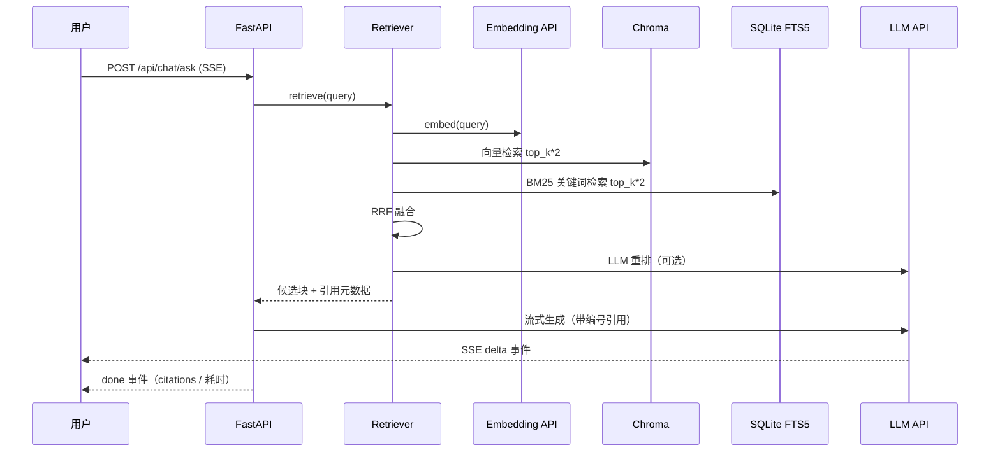

# KnowHub（知枢）架构说明

企业级 RAG 知识库 Agent：**文档接入 → 解析切分 → 向量化 → 混合检索 → LLM 重排 → 带引用流式回答**，
并覆盖多租户、RBAC、审计、异步任务等企业级要求。

## 总体架构

```mermaid
flowchart LR
    subgraph Client
        UI[Vue 3 + Ant Design Vue 控制台<br/>问答 / 知识库 / 系统管理]
    end

    subgraph Backend[FastAPI 后端]
        API[API 层<br/>auth / kbs / documents / chat / admin]
        SVC[服务层<br/>ingestion / chat / audit]
        RAG[AG 核心<br/>parsers → chunkers → embeddings<br/>retriever(混合+重排) → pipeline]
        TASK[任务管理器<br/>asyncio 异步索引]
    end

    subgraph Storage[存储]
        DB[(SQLite/PostgreSQL<br/>用户/知识库/文档/块/会话/审计)]
        VS[(ChromaDB<br/>向量索引)]
        FTS[(SQLite FTS5<br/>关键词索引 jieba)]
        FS[(文件系统<br/>原始文档)]
    end

    UI -->|REST / SSE| API
    API --> SVC
    API --> TASK
    SVC --> RAG
    TASK --> RAG
    RAG --> VS
    RAG --> FTS
    RAG --> DB
    SVC --> DB
    SVC --> FS

    RAG -->|OpenAI 兼容协议| GW[LLM 网关<br/>DashScope / OpenAI / 任意兼容网关]
    GW -->|chat completions| LLM[对话模型<br/>qwen-max / glm-5 ...]
    GW -->|embeddings| EMB[向量模型<br/>qwen3.7-text-embedding]
```

## 数据流（一次问答）



## 模块说明

| 模块 | 路径 | 职责 |
|---|---|---|
| 配置 | `backend/app/core/config.py` | pydantic-settings 读取 `.env`，模型列表降级、RAG 参数 |
| 安全 | `backend/app/core/security.py` | PBKDF2-SHA256(60万轮) 密码哈希、JWT(HS256) |
| 数据模型 | `backend/app/models` | Tenant/User/KB/Document/Chunk/Session/Message/AuditLog |
| 文档解析 | `backend/app/rag/parsers.py` | txt/md/html/pdf/docx/xlsx/pptx，PDF 保留页码 |
| 切分 | `backend/app/rag/chunkers.py` | Markdown 标题感知 + 定长重叠切分 |
| 向量库 | `backend/app/rag/vector_store.py` | Chroma 持久化，每知识库独立 collection |
| 检索 | `backend/app/rag/retriever.py` | 向量 + jieba/FTS5 BM25 + RRF 融合 + LLM 重排 |
| 编排 | `backend/app/rag/pipeline.py` | 系统提示词、引用格式化、流式回答 |
| 任务 | `backend/app/tasks/manager.py` | asyncio 索引任务注册表，重启恢复 |
| API | `backend/app/api/` | 认证/知识库/文档/问答/管理/审计 |
| 前端 | `frontend/src/` | Vue 3 + TypeScript + Pinia + Ant Design Vue 企业控制台 |

## 企业级能力清单

1. **多租户**：租户级数据隔离，非管理员仅见本租户知识库（`tenant_id` 作用域过滤）
2. **RBAC**：admin / editor / viewer 三级角色，接口级强制校验
3. **审计**：登录、上传、删除、问答等全部留痕，管理端可查询
4. **异步索引**：上传即返回，后台解析→切分→向量化，前端轮询进度；重启自动恢复中断任务
5. **高可用检索**：向量 + 关键词混合，RRF 融合兜底召回；LLM 重排提升精度（可开关）
6. **模型降级**：主模型失败自动切换备用模型（`qwen-max → glm-5 → …`）
7. **安全**：PBKDF2 密码、JWT 过期、登录限流、问答限流、上传类型/大小校验
8. **引用溯源**：每条回答携带引用（文档/页码/片段/相关度），前端可点击查看原文片段
9. **可观测**：健康检查、系统统计、RAG 参数面板、各阶段耗时上报

## 生产化建议（超出当前本地实现的演进路径）

- **数据库**：切换 PostgreSQL（改 `DB_URL` 即可），向量库可迁移 Milvus/Qdrant（实现 `VectorStore` 同构接口）
- **任务队列**：多实例部署时替换为 Celery/Redis 或消息队列，索引任务跨进程
- **限流**：接入 Redis 滑动窗口，替代内存桶（多实例共享）
- **网关**：已在 `LLM_API_URL` 抽象为 OpenAI 兼容协议，可直连任何企业网关（含私有化 vLLM）
- **密钥管理**：`JWT_SECRET`/`LLM_API_KEY` 生产环境应从 KMS/密钥库注入，禁用 `AUTO_SEED_ADMIN` 默认口令
- **HTTPS**：nginx 配置 TLS；审计日志建议接入 SIEM
